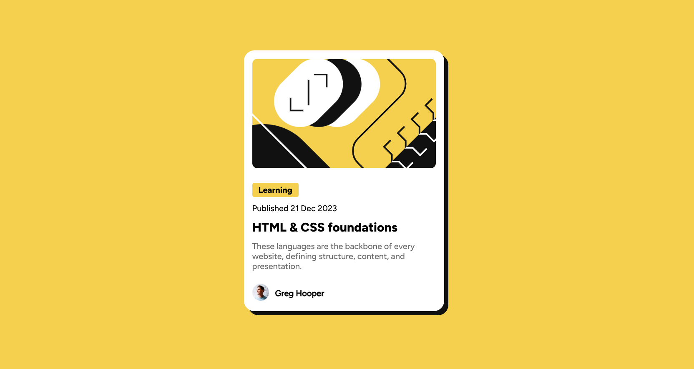

# Frontend Mentor - Blog preview card solution

This is a solution to the [Blog preview card challenge on Frontend Mentor](https://www.frontendmentor.io/challenges/blog-preview-card-ckPaj01IcS). Frontend Mentor challenges help you improve your coding skills by building realistic projects.

## Table of contents

- [Overview](#overview)
  - [The challenge](#the-challenge)
  - [Screenshot](#screenshot)
  - [Links](#links)
- [My process](#my-process)
  - [Built with](#built-with)
  - [What I learned](#what-i-learned)
  - [Continued development](#continued-development)
  - [Useful resources](#useful-resources)
- [Author](#author)
- [Acknowledgments](#acknowledgments)

## Overview

### The challenge

Users should be able to:

- See hover and focus states for all interactive elements on the page

### Screenshot



### Links

- Solution URL: [Github](https://github.com/MrEkwunife/blog-preview-card)
- Live Site URL: [Vercel](https://blog-preview-card-cyan-alpha.vercel.app/)

## My process

### Built with

- Semantic HTML5 markup
- CSS custom properties
- Flexbox
- Mobile-first workflow

### What I learned

Learnt about the honrizontal and vertical offset of the box-shadow css property.
Also learnt how to include a font-family that is not from the google fonts (locally downloaded font instead)

```css
.main {
  box-shadow: 10px 10px orangered;
}
```

```js
const proudOfThisFunc = () => {
  console.log("🎉");
};
```

### Continued development

Focus on my css Animations

### Useful resources

- [MDN WebDocs](https://developer.mozilla.org/en-US/) - This helped me understand how the box-shadow property works
- [Google](https://www.google.com) - Googled some forgotten synthaxes

## Author

- Website - [Chimobi Ekwunife](https://www.github.com/MrEkwunife)
- Frontend Mentor - [@MrEkwunife](https://www.frontendmentor.io/profile/MrEkwunife)
- X (Twitter) - [@MrEkwunife](https://www.x.com/MrEkwunife)

## Acknowledgments

Thank Frontendmentor, Frontendmasters and MDN web docs
